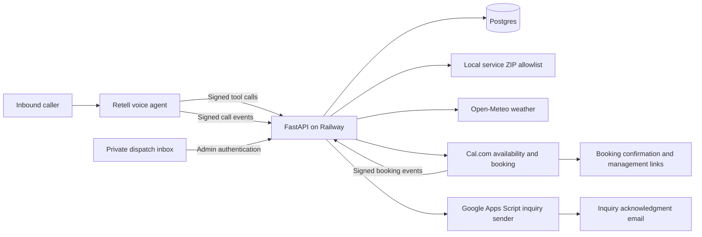

# Summit Air phone agent

AI phone agent for inbound residential and commercial HVAC calls, built for the
Revin Forward Deployed Engineer assignment.

**Live number: +1 (925) 433-7863**

## Architecture



Retell manages the phone connection, transcription, voice, and conversation.
Its prompt extracts caller facts and invokes backend tools. The Python backend
persists those facts, evaluates service coverage and urgency, and controls
availability and booking. Tool results determine what the agent can confirm.

| Component | Responsibility |
| --- | --- |
| [Agent prompt](prompts/summit_air_agent.md) | Conversation flow, clarification, safety guidance, pricing, and closing. |
| [Tool schema](prompts/tools.json) and [agent configuration](prompts/agent-config.json) | Published Retell functions and voice configuration. |
| [API](app/main.py) | Signed Retell tools/events, signed Cal.com webhooks, health endpoint, and authenticated dispatch API. |
| [Call engine](app/engine.py) | Saved call state, corrections, booking claims, uncertainty handling, and inquiry acknowledgments. |
| [Triage](app/triage.py) | Deterministic safety, urgency, scope routing, and required booking fields. |
| [Caller models](app/models.py) | Validated fact patches, contact numbers, email, and tool arguments. |
| [Coverage](app/coverage.py) | Exact membership in the bundled service ZIP allowlist. |
| [Provider adapters](app/providers.py) | Weather context, real Cal.com windows/bookings, and inquiry-email requests. |
| [Database](app/database.py) | Durable requests, appointment snapshots, webhook deduplication, and email-attempt records. |
| [Dispatch page](app/dispatch.html) | Team view of saved requests, urgency, bookings, messages, and commercial details. |
| [Gmail sender](scripts/gmail_inquiry_sender.gs) | Authenticated inquiry acknowledgments from the helpdesk Gmail account. |

## Call flow

The normal booking flow is issue and immediate risk, visit intent when unclear,
spelled name, service ZIP, address readback, callback confirmation, property
category, scheduling authorization, affected systems, confirmed email, real
openings, and booking consent. Already volunteered details are reused.

Commercial visits additionally collect a secondary site type, business/site name,
onsite contact and number, and access instructions. Floor, front desk, entrances,
parking, building codes, and access hours share one free-text field. An onsite
caller can reuse their confirmed contact details. Unknown preparation details
do not add booking restrictions.

The agent offers the earliest returned appointment window and asks whether it
works or specific days are better. A preferred day triggers another search.
After a successful booking it explains the $99 dispatch fee, additional costs
reviewed before repairs, and confirmation-email management links, then asks
whether anything else is needed.

Quote inquiries and team messages use a shorter path without booking. The
caller's message and confirmed contact details are saved for team review; the
configured Gmail sender can send an acknowledgment. Email is mandatory to
complete a booking or follow-up request; partial requests remain saved.

## State and booking integrity

Each call has one durable `ServiceRequest`. Fact patches preserve unknown values
and increment its revision. Safety and vulnerability are saved before completing
contact intake. Backend results expose priority, routing, missing fields, service
coverage, and the next action.

Availability comes from Cal.com and is stored with opaque slot IDs. Booking
requires complete intake, a future offered slot, and explicit caller agreement.
An atomic database claim and unique appointment per request prevent overlapping
or repeated booking attempts from creating duplicate reservations. An uncertain
provider response blocks blind retries and preserves the request for review.

Appointments retain the facts sent at booking. Later changes to contact,
location, or commercial site details preserve that snapshot and flag team review;
they do not silently rewrite the external appointment. Signed Cal.com lifecycle
events update local appointment status and are deduplicated. Inquiry emails also
have one persisted attempt per request to prevent duplicate acknowledgments.

## Routing and operating assumptions

Gas smell, carbon monoxide concerns, smoke, fire, burning, and sparking override
intake with immediate safety guidance and block routine booking. No heat in cold
conditions and cooling outages with vulnerable occupants or dangerous heat get
urgent priority. Urgency is a saved dispatch flag; it does not guarantee an
arrival time or automatically page a technician.

Ordinary residential and commercial service can book directly. Installations,
replacements, ductwork, large or building-wide scope, and unresolved authorization
require team review. Outside-area ZIPs stop booking intake immediately.

The demo covers Nassau, Suffolk, and Queens counties in New York using 283 bundled
ZIPs. Street details are caller supplied and confirmed by readback; street lookup
is not a booking gate. [ZIP data](app/service_zipcodes.json) is attributed to
[GeoNames](https://www.geonames.org/) under CC BY 4.0. Weather uses approximate ZIP
coordinates as supporting context.

The calendar uses America/New_York, Monday–Saturday service hours, two-hour
windows, and a 60-minute minimum booking notice. It represents one demo service
calendar; technician assignment, travel time, and forty-technician capacity are
future integrations. SMS, payments, live transfers, and voice rescheduling are
outside this implementation; Cal.com email links support appointment management.

## Runtime configuration

Python 3.12 and environment settings from [.env.example](.env.example) run the API:

```sh
python3.12 -m venv .venv
.venv/bin/python -m pip install -r requirements.txt
cp .env.example .env
# Supply provider credentials and event configuration in .env.
.venv/bin/python -m uvicorn app.main:app --reload
```

Local development uses SQLite. Railway runs the [Dockerfile](Dockerfile) with
persistent Postgres and the [deployment configuration](railway.json).
Production requires Retell and admin credentials and rejects SQLite.

Retell calls the HTTPS tool endpoints with its designated Webhook signing key.
The dispatch page loads caller records only through the admin-authenticated API.
Cal.com uses a signed lifecycle webhook. Inquiry email uses the Apps Script sender
with a shared token stored in script properties and backend configuration.
Real secrets remain in local environment files and provider settings.

Start reviewing with the agent prompt, then the call engine, triage rules, and
provider adapters.
